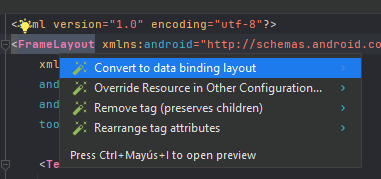
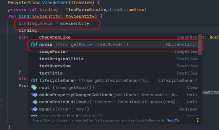

# Vinculación de vistas viewBinding y dataBinding

La vinculación de vista es una función que te permite escribir más fácilmente código que interactúa
con las vistas. Una vez que la vinculación de vista está habilitada en un módulo, genera una clase
de vinculación para cada archivo de diseño XML presente en ese módulo. Una instancia de una clase de
vinculación contiene referencias directas a todas las vistas que tienen un ID en el diseño
correspondiente.

En la mayoría de los casos, la vinculación de vistas reemplaza a findViewById.

## Descripción General

### Vinculación de Vistas

#### ViewBinding

- **¿Qué es?** ViewBinding es una característica que permite acceder de manera directa y segura a
  las vistas en un archivo de diseño (layout) a través de objetos generados automáticamente.
- **Cómo funciona:** Al habilitar ViewBinding, se genera una clase de enlace para cada archivo de
  diseño en la aplicación. Esta clase contiene referencias directas a las vistas definidas en el
  layout, lo que evita el uso de `findViewById` y reduce los errores de tipo.
- **Ventajas:**
    - Más seguro: Evita errores de referencia nulos al acceder a las vistas.
    - Más eficiente: Las referencias son generadas en tiempo de compilación y son más eficientes en
      términos de rendimiento que `findViewById`.
    - Menos código boilerplate: Elimina la necesidad de escribir código tedioso para buscar y
      referenciar vistas.

#### DataBinding

- **¿Qué es?** DataBinding es una biblioteca que permite enlazar los datos del modelo de datos
  directamente con la interfaz de usuario (layout) de una manera declarativa utilizando expresiones
  y reglas de enlace.
- **Cómo funciona:** Permite la sincronización automática de datos entre la capa de presentación (
  UI) y la capa de lógica o modelo. Esto se logra mediante la creación de enlaces directos entre los
  elementos de la interfaz de usuario y las fuentes de datos, evitando manipulaciones manuales de
  las vistas.
- **Ventajas:**
    - Menos código: Permite reducir la cantidad de código necesario para actualizar las vistas con
      datos actualizados.
    - Separación de preocupaciones: Facilita la separación clara entre la lógica de presentación y
      el modelo de datos.
    - Facilita la automatización: Permite la actualización automática de las vistas cuando los datos
      subyacentes cambian.

### Comparación y Uso Conjunto

- **ViewBinding vs. DataBinding:** ViewBinding es más ligero y se centra en la vinculación de vistas
  directas, mientras que DataBinding va más allá al permitir una vinculación más compleja de datos y
  lógica de presentación.
- **Uso conjunto:** Se pueden utilizar tanto ViewBinding como DataBinding en una misma aplicación.
  ViewBinding puede utilizarse para acceder a las vistas de forma más segura y eficiente, mientras
  que DataBinding puede emplearse para vincular y actualizar automáticamente las vistas con datos
  específicos del modelo.

En resumen, ViewBinding y DataBinding son herramientas valiosas para simplificar la vinculación de
vistas en aplicaciones Android, ofreciendo distintas características y flexibilidad para manejar la
interacción entre la capa de presentación y el modelo de datos. Su elección dependerá de las
necesidades específicas de la aplicación y el grado de control y automatización requeridos en la
interfaz de usuario.

### Implementación

#### Gradle DSL

En el archivo [app/build.gradle](../../../../../../../build.gradle) se _ la vinculación de vistas
dentro de la sección de buildFeatures.

```groovy
plugins {

}

android {
    // Other configuration
    buildFeatures {
        viewBinding true
        dataBinding true
    }
}
```

#### Kotlin DSL

En el archivo [app/build.gradle](../../../../../../../build.gradle.kts) se _ la vinculación de
vistas
dentro de la sección de buildFeatures.

```kotlin
plugins {

}

android {
    // Other configuration
    buildFeatures {
        viewBinding = true
        dataBinding = true
    }
}
```

___

# Ejemplos

## Binding

### Activity

#### Java

```java
public class SplashActivity extends AppCompatActivity {
    @Override
    protected void onCreate(@Nullable Bundle savedInstanceState) {
        super.onCreate(savedInstanceState);
        var binding = ActivitySplashBinding.inflate(getLayoutInflater());
        var viewModel = new ViewModelProvider(this).get(SplashViewModel.class);
        setContentView(binding.getRoot());
    }
}
```

#### Kotlin

```kotlin
class SplashActivity : AppCompatActivity() {
    override fun onCreate(savedInstanceState: Bundle?) {
        super.onCreate(savedInstanceState)
        val binding = ActivitySplashBinding.inflate(
            layoutInflater
        )
        val viewModel = ViewModelProvider(this)[SplashViewModel::class.java]
        setContentView(binding.root)
    }
}
```

### Fragment

#### Kotlin

```kotlin
class BudgetFragment : Fragment() {

    private lateinit var binding: FragmentBudgetBinding
    private lateinit var viewModel: BudgetViewModel

    override fun onCreateView(
        inflater: LayoutInflater, container: ViewGroup?,
        savedInstanceState: Bundle?
    ): View {
        binding = FragmentBudgetBinding.inflate(inflater, container, false)
        viewModel = ViewModelProvider(this)[BudgetViewModel::class.java]
        return binding.root
    }
}
```

#### Java

```java
public class BlankFragment extends Fragment {

    private BlankViewModel mViewModel;
    private FragmentBlankBinding binding;

    public static BlankFragment newInstance() {
        return new BlankFragment();
    }

    @Override
    public View onCreateView(@NonNull LayoutInflater inflater, @Nullable ViewGroup container,
                             @Nullable Bundle savedInstanceState) {
        binding = FragmentBlankBinding.inflate(inflater, container, false);
        mViewModel = new ViewModelProvider(this).get(BlankViewModel.class);
        return binding.getRoot();
    }
}
```

### Adapter

#### Kotlin

```kotlin
override fun onCreateViewHolder(parent: ViewGroup, viewType: Int) = MovieViewHolder(
    LayoutInflater.from(parent.context).inflate(R.layout.item_movie, parent, false),
    movieInterface
)
```

#### Java

```java
@NonNull
@Override
public MovieViewHolder onCreateViewHolder(@NonNull ViewGroup parent,int viewType){
        return new MovieViewHolder(
        LayoutInflater.from(parent.getContext()).inflate(R.layout.item_movie,parent,false),
        movieInterface
        );
        }
```

### ViewHolder

#### Kotlin

```kotlin
class MovieViewHolder(itemView: View, private val movieInterface: (Int, Boolean) -> Unit) :
    RecyclerView.ViewHolder(itemView) {
    private val binding = ItemMovieBinding.bind(itemView)
}
```

#### Java

```java
public class MovieViewHolder extends RecyclerView.ViewHolder {

    private final ItemMovieBinding binding;
    private final MovieInterface movieInterface;

    public MovieViewHolder(@NonNull View itemView, MovieInterface movieInterface) {
        super(itemView);
        binding = ItemMovieBinding.bind(itemView);
        this.movieInterface = movieInterface;
    }
}
```

### dataBinding

Una vez definida la variable binding en la clase, se deberá contener la vista completa dentro del
tag <layout> para
declarar el objeto del pojo en la vista.



### Pojo

#### Kotlin

```kotlin
class MovieEntity(
    var id: Int,
    var title: String,
    var originalTitle: String,
    var overview: String,
    var posterPath: String,
    var like: Boolean
)
```

#### Java

```java
public class MovieEntity {

    private int id;
    private String title;
    private String originalTitle;
    private String overview;
    private final String posterPath;
    private final Boolean like;

    public MovieEntity(int id, String title, String originalTitle, String overview, String posterPath, Boolean like) {
        this.id = id;
        this.title = title;
        this.originalTitle = originalTitle;
        this.overview = overview;
        this.posterPath = posterPath;
        this.like = like;
    }

    public int getId() {
        return id;
    }

    public void setId(int id) {
        this.id = id;
    }

    public String getTitle() {
        return title;
    }

    public void setTitle(String title) {
        this.title = title;
    }

    public String getOriginalTitle() {
        return originalTitle;
    }

    public void setOriginalTitle(String originalTitle) {
        this.originalTitle = originalTitle;
    }

    public String getOverview() {
        return overview;
    }

    public void setOverview(String overview) {
        this.overview = overview;
    }

    public String getPosterPath() {
        return posterPath;
    }

    public Boolean getLike() {
        return like;
    }

}
```

#### Declaración en el layout

```xml
<?xml version="1.0" encoding="utf-8"?>
<layout>

    <data>

        <variable name="movie"
            type="com.example.dagger_hilt.data.datasource.database.entities.MovieEntityKts" />
    </data>
</layout>
```

Posteriormente, la variable permitirá acceder a los miembros del pojo haciendo referencia a le del
siguiente modo:

```xml

<TextView android:id="@+id/text_title" style="@style/TextAppearance.AppCompat.Title"
    android:layout_width="match_parent" android:layout_height="wrap_content"
    android:layout_margin="16sp" android:text="@{movie.title}"
    app:layout_constraintEnd_toEndOf="parent" app:layout_constraintStart_toStartOf="parent"
    app:layout_constraintTop_toBottomOf="@+id/image_poster" tools:text="Title" />
```

Para establecer el pojo en la vista, se accede al dato mediante la variable binding.

