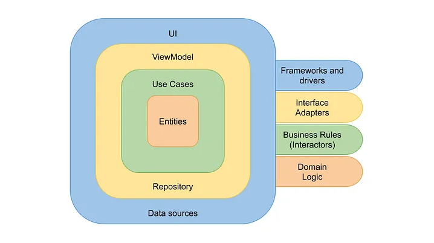

# Clean Architecture

La Arquitectura Limpia (Clean Architecture) es un enfoque de diseño de software propuesto por Robert
C. Martin, también conocido como "Uncle Bob". Se basa en el principio de separar claramente las
preocupaciones dentro de un sistema, con el objetivo principal de lograr un código más mantenible,
testeable y adaptable a cambios.

En Clean Architecture, se establece una serie de capas concéntricas, cada una con su responsabilidad
y nivel de abstracción, y estas capas están organizadas de manera jerárquica:

1. **Entities (Entidades):** Representan la base del negocio, contienen las reglas de negocio y su
   lógica. Son clases o estructuras que encapsulan datos y comportamientos esenciales para el
   dominio.
2. **Use Cases (Casos de uso):** Aquí se definen las acciones o funcionalidades específicas que
   puede realizar el sistema. Estos casos de uso encapsulan la lógica del negocio y son
   independientes de la interfaz de usuario o de cualquier framework.
3. **Interactors (Interactores) o Business Logic (Lógica de negocio):** Son clases que implementan
   los casos de uso. Su objetivo principal es orquestar la lógica empresarial utilizando las
   entidades y cualquier dependencia externa que necesiten.
4. **Interfaces de adaptador:** Estas capas se dividen en dos partes:

   a. **Interfaces de Controladores o Presentadores:** Son interfaces que interactúan con los casos
   de uso. Se encargan de manejar la entrada y salida del sistema, pero no contienen lógica de
   negocio. Por ejemplo, interfaces gráficas de usuario, controladores HTTP, etc.

   b. **Interfaces de Entidades externas:** Aquí se encuentran las implementaciones concretas de los
   detalles externos al sistema, como bases de datos, frameworks, servicios externos, etc. Estas
   implementaciones se adaptan para comunicarse con las capas internas del sistema.

La idea clave detrás de Clean Architecture es que las capas internas no dependan de las capas
externas, lo que permite que el núcleo del negocio permanezca independiente de los detalles de
implementación externos. Esto hace que el código sea más mantenible, ya que los cambios en las capas
externas no afectan la lógica principal del negocio, y también facilita las pruebas, ya que las
capas internas pueden ser probadas de manera aislada.

En resumen, Clean Architecture promueve un diseño que prioriza la separación de preocupaciones, la
independencia de detalles de implementación y la claridad en la estructura del software para
facilitar su mantenimiento y evolución a lo largo del tiempo.

> Recomiendo leer el articulo
> _[Android — Desmitificando Clean Architecture
> ](https://medium.com/kotlin-dev-reactor/android-desmitificando-clean-architecture-2d0ed6aa2de6)_
> para aprender más sobre el tema.
